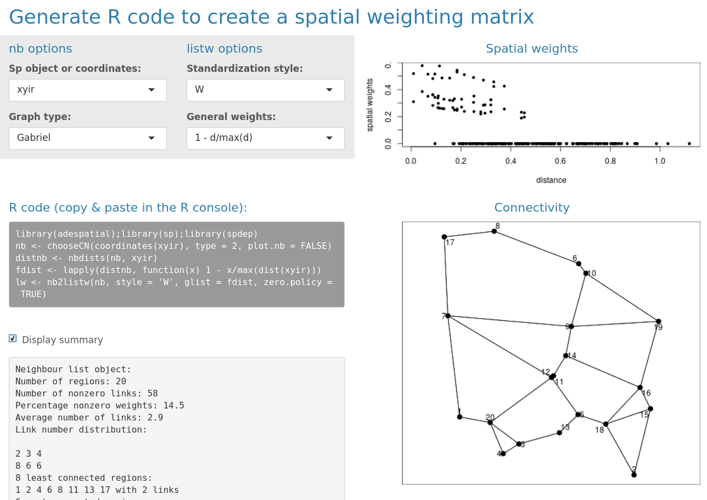

\newcommand{\tr}{\hspace{-0.05cm}^{\top}\hspace{-0.05cm}} 

```{r setup, include=FALSE}
knitr::opts_chunk$set(fig.align = "center")
```

The package `adespatial` contains functions for the multiscale analysis of spatial multivariate data. It implements some new functions and reimplements existing functions that were available in packages of the sedaR project hosted on R-Forge (`spacemakeR`, `packfor`, `AEM`, etc.). It can be seen as a bridge between packages dealing with mutltivariate data (e.g., `ade4`, @Dray2007) and packages that deals with spatial data (`sp`, `spdep`). In `adespatial`, many methods consider the spatial information as a spatial weighting matrix (SWM), object of class `listw` provided by the `spdep` package ([Figure 1](#diagram)). The SWM is defined as the Hadamard product (element-wise product) of a connectivity matrix by a weighting matrix. The binary connectivity matrix (spatial neighborhood, object of class `nb`) defines the pairs of connected and unconnected samples, while the weighting matrix allows weighting the connections, for instance to define that the strength of the connection between two samples decreases with the geographic distance.  

Once SWM is defined, it can be used to build Moran's Eigenvector Maps (MEM, @Dray2006) that are orthogonal vectors maximizing the spatial autocorrelation (measured by Moran's coefficient). These spatial predictors can be used in multivariate statistical methods to provide spatially-explicit multiscale tools [@Dray2012]. This document provides a description of the main functionalities of the package. 

<br>
<div style="text-align:center">
<a name="diagram"></a>

<span style="color:blue">Figure 1: Schematic representation of the functioning of the `adespatial` package. Classes are represented in pink frames and functions in blue frames. Classes and functions provided by `adespatial` are in bold. </span>
</div>
<br>

To run the different analysis described, several packages are required and are loaded:

```{r}
library(adespatial)
library(ade4)
library(adegraphics)
library(spdep)
library(maptools)
```

# Building spatial neighborhood

Spatial neighborhoods are managed in `spdep` as objects of class `nb`. It corresponds to the notion of connectivity matrices discussed in @Dray2006 and can be represented by an unweighted graph. Various functions allow to create `nb` objects from geographic coordinates of sites. We present different alternatives according to the design of the sampling scheme.

## Surface data

The function `poly2nb` allows to define neighborhood when the sampling sites are polygons and not points (two regions are neighbors if they share a common boundary). The resulting object can be plotted on a geographical map using the `s.Spatial` function of the `adegraphics` package [@Siberchicot2017].

```{r}
data(mafragh)
class(mafragh$Spatial)
nb.maf <- poly2nb(mafragh$Spatial)
s.Spatial(mafragh$Spatial, nb = nb.maf, plabel.cex = 0, pnb.edge.col = 'red')
```

## Regular grid and transect

If the sampling scheme is based on regular sampling (e.g., grid of 8 rows and 10 columns), spatial coordinates can be easily generated:

```{r}
xygrid <- expand.grid(x = 1:10, y = 1:8)
s.label(xygrid, plabel.cex = 0)
``` 

For a regular grid, spatial neighborhood can be created with the function `cell2nb`. Two types of neighborhood can be defined. The `queen` specification considered horizontal, vertical and diagonal edges whereas the `rook` specification considered only horizontal and vertical edges:  

```{r}
nb2.q <- cell2nb(8, 10, type = "queen")
nb2.r <- cell2nb(8, 10, type = "rook")
s.label(xygrid, nb = nb2.q, plabel.cex = 0, main = "Queen neighborhood")
s.label(xygrid, nb = nb2.r, plabel.cex = 0, main = "Rook neighborhood")
``` 

The function `cell2nb` is the easiest way to deal with transects by considering a grid with only one row:

```{r}
xytransect <- expand.grid(1:20, 1)
nb3 <- cell2nb(20, 1)

summary(nb3)
```

All sites have two neighbors except the first and the last one.

## Irregular sampling

There are many ways to define the neighborhood in the case of irregular samplings. We consider a random sampling with 20 sites:

```{r}
set.seed(3)
xyir <- matrix(runif(40), 20, 2)
s.label(xyir, main = "Irregular sampling with 10 sites")
```

The most intuitive way is to consider that sites are neighbors (or not) according to the distances between them. This definition is provided by the `dnearneigh` function:

```{r, fig.width = 5}
nbnear1 <- dnearneigh(xyir, 0, 0.2)
nbnear2 <- dnearneigh(xyir, 0, 1.5)

g1 <- s.label(xyir, nb = nbnear1, pnb.edge.col = "red", main = "neighbors if 0<d<0.2", plot = FALSE)
g2 <- s.label(xyir, nb = nbnear2, pnb.edge.col = "red", main = "neighbors if 0<d<1.5", plot = FALSE)
cbindADEg(g1, g2, plot = TRUE)
```

Using a distance-based criteria could lead to unbalanced graphs. For instance, if the maximum distance is too low, some points have no neighbors:
```{r}
nbnear1
```

On the other hand, if the maximum distance is too high, all sites are connected:
```{r}
nbnear2
```


It is also possible to define neighborhood by a criteria based on nearest neighbors. However, this option can lead to non-symmetric neighborhood: if site A is the nearest neighbor of site B, it does not mean that site B is the nearest neighbor of site A.

The function `knearneigh` creates an object of class `knn`. It can be transformed into a `nb` object with the function `knn2nb`. This function has an argument `sym` which can be set to `TRUE` to force the output neighborhood to symmetry.

```{r, fig.width = 5}
knn1 <- knearneigh(xyir, k = 1)
nbknn1 <- knn2nb(knn1, sym = TRUE)
knn2 <- knearneigh(xyir, k = 2)
nbknn2 <- knn2nb(knn2, sym = TRUE)

g1 <- s.label(xyir, nb = nbknn1, pnb.edge.col = "red", main = "Nearest neighbors (k=1)", plot = FALSE)
g2 <- s.label(xyir, nb = nbknn2, pnb.edge.col = "red", main = "Nearest neighbors (k=2)", plot = FALSE)
cbindADEg(g1, g2, plot = TRUE)
``` 
    
This definition of neighborhood can lead to unconnected subgraphs. The function `n.comp.nb` finds the number of disjoint connected subgraphs:

```{r}
n.comp.nb(nbknn1)
```

More elaborate procedures are available to define neighborhood. For instance, Delaunay triangulation is obtained with the function `tri2nb`. It requires the package `deldir`. Other graph-based procedures are also available:

```{r}
nbtri <- tri2nb(xyir)
nbgab <- graph2nb(gabrielneigh(xyir), sym = TRUE)
nbrel <- graph2nb(relativeneigh(xyir), sym = TRUE)
nbsoi <- graph2nb(soi.graph(nbtri, xyir), sym = TRUE)

g1 <- s.label(xyir, nb = nbtri, pnb.edge.col = "red", main = "Delaunay", plot = FALSE)
g2 <- s.label(xyir, nb = nbgab, pnb.edge.col = "red", main = "Gabriel", plot = FALSE)
g3 <- s.label(xyir, nb = nbrel, pnb.edge.col = "red", main = "Relative", plot = FALSE)
g4 <- s.label(xyir, nb = nbsoi, pnb.edge.col = "red", main = "Sphere of influence", plot = FALSE)

ADEgS(list(g1, g2, g3, g4))
```

The `adespatial` functions `chooseCN` and `listw.candidates` provides simple ways to build spatial neighborhoods. They are wrappers of many of the `spdep` functions presented above. The function `listw.explore` is an interactive graphical interface that allows to generate R code to build neighborhood objects (see [Figure 2](#listw.explore)). 

## Manipulating `nb` objects

A `nb` object is not stored as a matrix. It is a list of neighbors. The neighbors of the first site are in the first element of the list:

```{r}
nbgab[[1]]
```

Various tools are provided by `spdep` to deal with these objects. For instance, it is possible to identify differences between two neighborhoods:

```{r}
diffnb(nbsoi, nbrel)
```

Usually, it can be useful to remove some connections due to edge effects. In this case, the function `edit.nb` provides an interactive tool to add or delete connections.

The function `include.self` allows to include a site in its own list of neighbors (self-loops). The `spdep` package provides many other tools to manipulate `nb` objects:

```
intersect.nb(nb.obj1, nb.obj2)
union.nb(nb.obj1, nb.obj2)
setdiff.nb(nb.obj1, nb.obj2)
complement.nb(nb.obj)
droplinks(nb, drop, sym = TRUE)
nblag(neighbours, maxlag)
```

# Defining spatial weighting matrices {#swm}

A spatial weighting matrices (SWM) is computed by a transformation of a spatial neighborhood. In R, they are not stored as matrices but as objects of the class `listw`. This format is more efficient than a matrix representation to manage large data sets. An object of class `listw` can be easily created from an object of class `nb` with the function `nb2listw`.

Different objects `listw` can be obtained from a `nb` object. The argument `style` allows to define a transformation of the matrix such as standardization by row sum, by total sum or binary coding, etc. General spatial weights can be introduced by the argument `glist`. This allows to introduce, for instance, a weighting relative to the distances between the points. For this task, the function `nbdists` is very useful as it computes Euclidean distance between neighbor sites defined by an `nb` object.

To obtain a simple row-standardization, the function is simply called by:

```{r}
nb2listw(nbgab)
```


More sophisticated forms of spatial weighting matrices can be defined. For instance, it is possible to weight edges between neighbors as functions of geographic distances. In a fist step, distances between neighbors are obtained by the function \texttt{nbdists}:

```{r}
distgab <- nbdists(nbgab, xyir)
nbgab[[1]]
distgab[[1]]
```

Then, spatial weights are defined as a function of distance (e.g. $1-d_{ij}/max(d_{ij})$):

```{r}
fdist <- lapply(distgab, function(x) 1 - x/max(dist(xyir)))
```

And the spatial weighting matrix is then created:

```{r}
listwgab <- nb2listw(nbgab, glist = fdist, style = "B")
listwgab
names(listwgab)
listwgab$neighbours[[1]]
listwgab$weights[[1]]
```

The matrix representation of a `listw` object can also be obtained:

```{r}
print(listw2mat(listwgab)[1:10, 1:10], digits = 3)
```

To facilitate the building of spatial neighborhoods (`nb` object) and associated spatial weighting matrices (`listw` object), the package `adespatial` provides several tools. An interactive graphical interface is launched by the call `listw.explore()` assuming that spatial coordinates are still stored in an object of the R session ([Figure 2](#listw.explore)).

<br>
<div style="text-align:center">
<a name="listw.explore"></a>

<span style="color:blue">Figure 2: The interactive interface provided by the function `listw.explore`. </span>
</div>
<br>

# Creating spatial predictors

The package `adespatial` provide different tools to build spatial predictors that can be incorporated in multivariate analysis. They are orthogonal vectors stored in a object of class `orthobasisSp`. Orthogonal polynomials of geographic coordinates can be computed by the function `orthobasis.poly` whereas principal coordinates of neighbour matrices (PCNM, @Borcard2002) are obtained by the function `dbmem`. 

The Moran's Eigenvectors Maps (MEMs) provide the most flexible framework. If we consider the $n \times n$ spatial weighting matrix $\mathbf{W} = [w_{ij}]$, they are the $n-1$ eigenvectors obtained by the diagonalization of the doubly-centred SWM:

$$
\mathbf{\Omega V}= \mathbf{V \Lambda}
$$

where $\mathbf{\Omega} = \mathbf{HWH}$ is the doubly-centred SWM and $\mathbf{H} = \left ( \mathbf{I}-\mathbf{11}\tr /n \right )$ is the centring operator. 

MEMs are orthogonal vectors with a unit norm that maximize Moran's coefficient of spatial autocorrelation [@Griffith1996; @Dray2012] and are stored in matrix $\mathbf{V}$. 

MEMs are provided by the functions `scores.listw` or `mem` of the `adespatial` package. These two functions are exactly identical (both are kept for historical reasons and compatibility) and return an object of class `orthobasisSp`. 

```{r}
mem.gab <- mem(listwgab)
mem.gab
```

This object contains MEMs, stored as a `data.frame` and other attributes:
```{r}
str(mem.gab)
```

The eigenvalues associated to MEMs are stored in the attribute called `values`:
```{r, echo = -1}
par(mar = c(0, 2, 3, 0))
    barplot(attr(mem.gab, "values"), 
        main = "Eigenvalues of the spatial weighting matrix", cex.main = 0.7)
```

A `plot` method is provided to represent MEMs. By default, eigenvectors are represented as a table (sites as rows, MEMs as columns):

```{r}
plot(mem.gab)
```

The previous representation is not really informative and MEMs can be represented in the geographical space as maps if the argument `SpORcoords` is documented:
```{r, fig.width = 5, fig.height = 5}
plot(mem.gab, SpORcoords = xyir, nb = nbgab)
```

Moran's I can be computed and tested for each eigenvector with the `moran.randtest` function:

```{r}
moranI <- moran.randtest(mem.gab, listwgab, 99)
moranI
```
By default, the function `moran.randtest` tests against the alternative hypothesis of positive autocorrelation (`alter = "greater"`) but this can be modified by setting the argument `alter` to `"less"` or `"two-sided"`. The function is not only devoted to MEMs and can be used to compute spatial autocorrelations for all kind of variables (see this [section](#mc)). 

As demonstrated in @Dray2006, eigenvalues and Moran's I are equal (post-multiply by a constant):

```{r}
attr(mem.gab, "values") / moranI$obs
```

Then, it is possible to map only positive significant eigenvectors (i.e., MEMs with significant positive spatial autocorrelation):

```{r, fig.width = 6, fig.height = 4}
signi <- which(moranI$pvalue < 0.05)
signi
plot(mem.gab[,signi], SpORcoords = xyir, nb = nbgab)
```

# Describing spatial patterns
In the previous sections, we considered only the spatial information as a geographic map, a spatial weighting matrix (SWM) or a basis of spatial predictors (e.g., MEM). In the next sections, we will show how the spatial information can be integrated to analyze multivariate data to identify multiscale spatial patterns. The dataset `mafragh` available in `ade4` will be used to illustrate the different methods.  

## The Mafragh data set

The Mafragh data set is available in the `ade4` package and stored as a `list`: 

```{r}
data("mafragh")
class(mafragh)
names(mafragh)
dim(mafragh$flo)
```

The `data.frame` `mafragh$flo` is a floristic table that contains the abundance of 56 plant species in 97 sites in Algeria. Names of species are listed in `mafragh$spenames`. The geographic coordinates of the sites are given in `mafragh$xy`.

```{r}
str(mafragh$env)
```

The `data.frame` `mafragh$env` contains 11 quantitative environmental variables. 
A map of the study area is also available (`mafragh$Spatial`) that can be used as a background to display the sampling design: 

```{r, fig.height = 4, fig.width = 4}
s.label(mafragh$xy, plabel.cex = 0, ppoint.pch = 15, ppoint.col = "darkseagreen4", Sp = mafragh$Spatial)
```

A more detailed description of the data set is available at http://pbil.univ-lyon1.fr/R/pdf/pps053.pdf (in French). 

The functionalities of the `adegraphics` package [@Siberchicot2017] can be used to design simple thematic maps to represent data. For instance, it is possible to represent the spatial distribution of two species using the `s.Spatial` function: 

```{r}
mafragh$spenames[c(1, 11), ]
```

```{r, fig.height=3, fig.width=6}
fpalette <- colorRampPalette(c("white", "darkseagreen2", "darkseagreen3", "palegreen4"))
sp.flo <- SpatialPolygonsDataFrame(Sr = mafragh$Spatial, data = mafragh$flo, match.ID = FALSE)
s.Spatial(sp.flo[,c(1, 11)], col = fpalette(3), nclass = 3)
```

## Moran's coefficient of spatial autocorrelation {#mc}

The element `mafragh$nb` contains a spatial neighborhood object that can be transformed in a spatial weighting matrix as described in this [section](#swm):

```{r}
lw <- nb2listw(mafragh$nb)
```

This SWM can be used to compute the level of spatial autocorrelation of a quantitative variable using the Moran's coefficient. If we consider the $n \times 1$ vector $\mathbf{x} = \left ( {x_1 \cdots x_n } \right )\tr$ containing measurements of a quantitative variable for $n$ sites and $\mathbf{W} = [w_{ij}]$ the SWM. The usual formulation for Moran's coefficient (MC) of spatial autocorrelation is:
$$
MC(\mathbf{x}) = \frac{n\sum\nolimits_{\left( 2 \right)} {w_{ij} (x_i -\bar 
{x})(x_j -\bar {x})} }{\sum\nolimits_{\left( 2 \right)} {w_{ij} } 
\sum\nolimits_{i = 1}^n {(x_i -\bar {x})^2} }\mbox{ where 
}\sum\nolimits_{\left( 2 \right)} =\sum\limits_{i = 1}^n {\sum\limits_{j = 1}^n 
} \mbox{ with }i\ne j
$$

MC can be rewritten using matrix notation:
$$
MC(\mathbf{x}) = \frac{n}{\mathbf{1}\tr\mathbf{W1}}\frac{\mathbf{z}\tr{\mathbf{Wz}}}{\mathbf{z}\tr\mathbf{z}}
$$
where $\mathbf{z} = \left ( \mathbf{I}-\mathbf{1}\mathbf{1}\tr /n \right )\mathbf{x}$ is the vector of centred values (i.e., $z_i = x_i-\bar{x}$).

The function `moran.mc` of the `spdep` package allows to compute and test, by permutation, the significance of the Moran's coefficient. A wrapper is provided by the `moran.randtest` function to test simultaneously and independently the spatial structure for several variables. 


```{r, fig.height=6, fig.width=8, out.width="80%"}
sp.env <- SpatialPolygonsDataFrame(Sr = mafragh$Spatial, data = mafragh$env, match.ID = FALSE)
maps.env <- s.Spatial(sp.env, col = fpalette(4), nclass = 4)
MC.env <- moran.randtest(mafragh$env, lw, nrepet = 999)
MC.env
```

For a given SWM, the upper and lower bounds of MC \citep{Jong1984} are equal to  $\lambda_{max} (n/\mathbf{1}\tr\mathbf{W1})$ and $\lambda_{min} (n/\mathbf{1}\tr\mathbf{W1})$ where $\lambda_{max}$ and $\lambda_{min}$ are the extreme eigenvalues of $\mathbf{\Omega}$. These extreme values are returned by the `moran.bounds` function:

```{r}
mc.bounds <- moran.bounds(lw)
mc.bounds
```

Hence, it is possible to display Moran's coefficients computed on environmental variables and the minimum and maximum values for the given SWM:

```{r, fig = TRUE}
env.maps <- s1d.barchart(MC.env$obs, labels = MC.env$names, plot = FALSE, ylim = 1.1 * mc.bounds, p1d.hori = FALSE)
addline(env.maps, h = mc.bounds, plot = TRUE, pline.col = 'red', pline.lty = 3)
```

## Decomposing Moran's coefficient

## MULTISPATI analysis

# Multiscale analysis with MEM
## Scalogram and MSPA
## Selection of SWM and MEM
## Redundancy Analysis
## Variation partitioning
## Testing with Moran's Spectral Randomization

# References