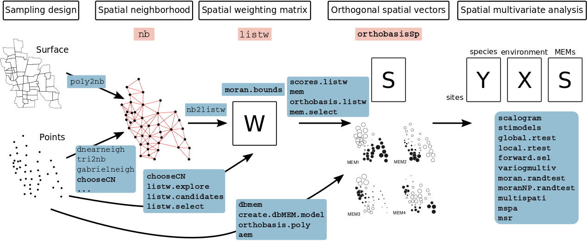
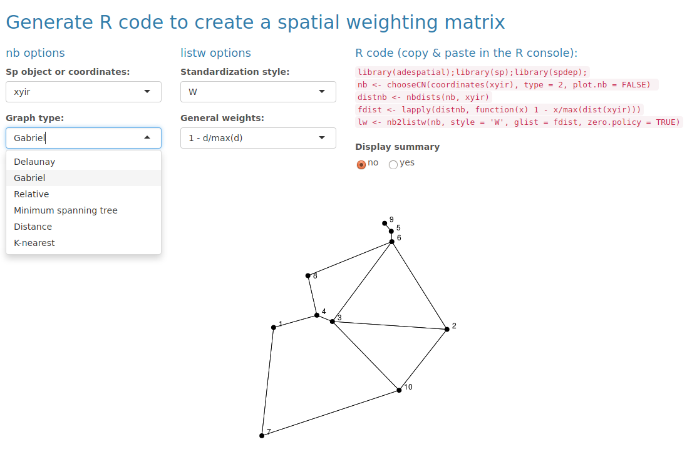

The package `adespatial` contains functions for the multiscale analysis of spatial multivariate data. It implements some new functions and reimplements existing functions that were available in packages of the sedaR project hosted on R-Forge (`spacemakeR`, `packfor`, `AEM`, etc.). It can be seen as a bridge between packages dealing with mutltivariate data (e.g., `ade4`, @Dray2007) and packages that deals with spatial data (`spdep`). In `adespatial`, the spatial information is considered as a spatial weighting matrix, object of class `listw` provided by the `spdep` package ([Figure 1](#diagram)). It allows to build Moran's Eigenvector Maps (MEM, @Dray2006) that are orthogonal vectors maximizing the spatial autocorrelation (measured by Moran's index of autocorrelation). These spatial predictors can be used in multivariate statistical methods to provide spatially-explicit multiscale tools [@Dray2012]. This document provides a description of the main functionalities of the package. 

<br>
<div style="text-align:center">
<a name="diagram"></a>

<span style="color:blue">Figure 1: Schematic representation of the functioning of the `adespatial` package. Classes are represented in pink frames and functions in blue frames. Classes and functions provided by `adespatial` are in bold. </span>
</div>
<br>

To run the different analysis described, several packages are required and are loaded:

```{r}
library(adespatial)
library(ade4)
library(adegraphics)
library(spdep)
library(maptools)
```

# Spatial Neighborhood

Spatial neighborhoods are managed in `spdep` as objects of class `nb`. It corresponds to the notion of connectivity matrices discussed in @Dray2006 and can be represented by an unweighted graph. Various functions are devoted to create `nb` objects from geographic coordinates of sites. We present different alternatives according to the design of the sampling scheme.

## Surface data

The function `poly2nb` allows to define neighborhood when the sampling sites are polygons and not points (two regions are neighbors if they share a common boundary).

```{r, echo = -1}
data(mafragh)
class(mafragh$Spatial)
par(mar = c(0, 0, 3, 0))
xx <- poly2nb(mafragh$Spatial)
plot(mafragh$Spatial, border = "grey")
plot(xx, coordinates(mafragh$Spatial), add = TRUE, pch = 20, col = "red")
title(main="Neighborhood for polygons")
```

## Regular grids

If the sampling scheme is based on grid of 10 rows and 8 columns, spatial coordinates can be easily generated:

```{r, echo = -1}
par(mar = rep(0,4))
xygrid <- expand.grid(x = 1:10, y = 1:8)
plot(xygrid, pch = 20, asp = 1)
``` 

For a regular grid, spatial neighborhood can be created with the function `cell2nb`. Two types of neighborhood can be defined. The `queen` specification considered horizontal, vertical and diagonal edges:

```{r, echo = -1}
par(mar = c(0, 0, 3, 0))

nb1 <- cell2nb(10, 8, type = "queen")

plot(nb1, xygrid, col = "red", pch = 20)
title(main = "Queen neighborhood")

nb1
``` 

The `rook` specification considered only horizontal and vertical edges:  

```{r, echo = -1}
par(mar = c(0, 0, 3, 0))
nb2 <- cell2nb(10, 8, type = "rook")

plot(nb2, xygrid, col = "red", pch = 20)
title(main = "Rook neighborhood")

nb2
```

## Transects

The easiest way to deal with transects is to consider them as grids with only one row:

```{r, echo = -1}
par(mar = c(0, 0, 3, 0))
xytransect <- expand.grid(1:20, 1)
nb3 <- cell2nb(20, 1)

plot(nb3, xytransect, col = "red", pch = 20)
title(main = "Transect of 20 sites")

summary(nb3)
```

All sites have two neighbors except the first and the last one.

## Irregular samplings

There are many ways to define neighborhood in the case of irregular samplings. We consider a random sampling with 10 sites:

```{r, echo = -1}
par(mar = c(0, 0, 3, 0))
set.seed(3)
xyir <- matrix(runif(20), 10, 2)
plot(xyir, pch = 20, main = "Irregular sampling with 10 sites")
```

The most intuitive way is to consider that sites are neighbors (or not) according to the distances between them. This definition is provided by the `dnearneigh` function:

```{r, fig.width = 5, echo = -1}
par(mar = c(0, 0, 3, 0), mfrow = c(2, 2))
nbnear1 <- dnearneigh(xyir, 0, 0.2)
nbnear2 <- dnearneigh(xyir, 0, 0.3)
nbnear3 <- dnearneigh(xyir, 0, 0.5)
nbnear4 <- dnearneigh(xyir, 0, 1.5)

plot(nbnear1, xyir, col = "red", pch = 20)
title(main = "neighbors if 0<d<0.2")
plot(nbnear2, xyir, col = "red", pch = 20)
title(main = "neighbors if 0<d<0.3")
plot(nbnear3, xyir, col = "red", pch = 20)
title(main = "neighbors if 0<d<0.5")
plot(nbnear4, xyir, col = "red", pch = 20)
title(main = "neighbors if 0<d<1.5")
```

Using a distance-based criteria could lead to unbalanced graphs. For instance, if the maximum distance is too low, some points have no neighbors:
```{r}
nbnear1
```

On the other hand, if the maximum distance is to high, all sites could connected to the 9 others:
```{r}
nbnear4
```


It is also possible to possible to define neighborhood by a criteria based on nearest neighbors. However, this option can lead to non-symmetric neighborhood: if site A is the nearest neighbor of site B, it does not mean that site B is the nearest neighbor of site A.

The function `knearneigh` creates an object of class `knn`. It can be transformed into a `nb` object with the function `knn2nb`. This function has an argument `sym` which can be set to `TRUE` to force the output neighborhood to symmetry.

```{r, fig.width = 5, echo = -1}
par(mar = c(0, 0, 3, 0), mfrow = c(1, 2))
knn1 <- knearneigh(xyir, k = 1)
nbknn1 <- knn2nb(knn1, sym = TRUE)
knn2 <- knearneigh(xyir, k = 2)
nbknn2 <- knn2nb(knn2, sym = TRUE)

plot(nbknn1, xyir, col = "red", pch = 20)
title(main = "Nearest neighbors (k=1)")
plot(nbknn2, xyir, col = "red", pch = 20)
title(main="Nearest neighbors (k=2)")
``` 
    
This definition of neighborhood can lead to unconnected subgraphs. The function `n.comp.nb` finds the number of disjoint connected subgraphs:

```{r}
n.comp.nb(nbknn1)
n.comp.nb(nbknn2)
```

More elaborate procedures are available to define neighborhood. For instance, Delaunay triangulation is obtained with the function `tri2nb`. It requires the package `deldir`. Other graph-based procedures are also available:

```{r, fig.width = 5, echo = -1}
par(mar = c(0, 0, 3, 0), mfrow = c(2, 2))
nbtri <- tri2nb(xyir)
nbgab <- graph2nb(gabrielneigh(xyir), sym = TRUE)
nbrel <- graph2nb(relativeneigh(xyir), sym = TRUE)
nbsoi <- graph2nb(soi.graph(nbtri, xyir), sym = TRUE)

plot(nbtri, xyir, col = "red", pch = 20)
title(main="Delaunay triangulation")
plot(nbgab, xyir, col = "red", pch = 20)
title(main = "Gabriel Graph")
plot(nbrel, xyir, col = "red", pch = 20)
title(main = "Relative Neighbor Graph")
plot(nbsoi, xyir, col = "red", pch = 20)
title(main = "Sphere of Influence Graph")
```

The function `chooseCN` provides a simple way to build spatial neighborhoods. It is a wrap up to many of the `spdep` functions presented above. The function `createlistw` discussed in section XX is an interactive graphical interface that allows to generate R code to build neighborhood objects.  

## Manipulation of `nb` objects

A `nb` object is a list of neighbors. The neighbors of the first site are in the first element of the list:

```{r}
nbgab[[1]]
```

Various tools are provided by `spdep` to deal with these objects. For instance, it is possible to identify differences between two neighborhoods:

```{r}
diffnb(nbsoi,nbrel)
```

Usually, it can be useful to remove some connections due to edge effects. In this case, the function `edit.nb` provides an interactive tool to add or delete connections.

The function `include.self` allows to include a site itself in its own list of neighbors:

```{r}
str(nbsoi)
str(include.self(nbsoi))
```

The `spdep` package provides many other tools to manipulate `nb` objects:

```
intersect.nb(nb.obj1, nb.obj2)
union.nb(nb.obj1, nb.obj2)
setdiff.nb(nb.obj1, nb.obj2)
complement.nb(nb.obj)

droplinks(nb, drop, sym = TRUE)

nblag(neighbours, maxlag)
```

# Spatial weighting matrices

Spatial weighting matrices are computed by a transformation of the spatial neighborhood objects. In R, they are not stored as matrices but as objects of the class `listw`. This format is more efficient than a matrix representation to manage large data sets. An object of class `listw` can be easily created from an object of class `nb` with the function `nb2listw`.

Different objects `listw` can be obtained from a `nb` object. The argument `style` allows to define a transformation of the matrix such as standardization by row sum, by total sum or binary coding, etc. General spatial weights can be introduced by the argument `glist`. This allows to introduce, for instance, a weighting relative to the distances between the points. For this task, the function `nbdists` is very useful as it computes Euclidean distance between neighbor sites defined by an `nb` object.

To obtain a simple row-standardization, the function is simply called by:

```{r}
nb2listw(nbgab)
```


More sophisticated forms of spatial weighting matrices can be defined. For instance, it is possible to weight edges between neighbors as functions of geographic distances. In a fist step, distances between neighbors are obtained by the function \texttt{nbdists}:

```{r}
distgab <- nbdists(nbgab, xyir)
str(distgab)
```

Then, spatial weights are defined as a function of distance (e.g. $1-d_{ij}/max(d_{ij})$):

```{r}
fdist <- lapply(distgab, function(x) 1-x/max(dist(xyir)))
```

And the spatial weighting matrix is then created:

```{r}
listwgab <- nb2listw(nbgab, glist = fdist, style = "B")
listwgab
names(listwgab)
listwgab$neighbours[[1]]
listwgab$weights[[1]]
```

The matrix representation of a `listw` object can also be obtained:

```{r}
print(listw2mat(listwgab),digits=3)
```

To facilitate the building of spatial neighborhoods (`nb` object) and associated spatial weighting matrices (`listw` object), the package `adespatial` provides an interactive graphical interface. The interface is launched by the call `listw.explore()` assuming that spatial coordinates are still stored in an object of the R session ([Figure 2](#createlistw)).

<br>
<div style="text-align:center">
<a name="createlistw"></a>

<span style="color:blue">Figure 2: The interactive interface provided by the function `listw.explore`. </span>
</div>
<br>

# Spatial predictors

The package `adespatial` provide different tools to build spatial predictors that can be incorporated in multivariate analysis. They are orthogonal vectors stored in a object of class `orthobasisSp`. Orthogonal polynomials of geographic coordinates can be computed by the function `orthobasis.poly` whereas traditional principal coordinates of neighbour matrices (PCNM, @Borcard2002) are obtained by the function `dbmem`. The more flexible Moran's eigenvectors maps (MEMs) of a spatial weighting matrix are computed by the functions `scores.listw` or `mem` of the `adespatial` package. These two functions are exactly identical and return an object of class `orthobasisSp`. 

```{r}
mem.gab <- mem(listwgab)
mem.gab
```

This object contains MEMs, stored as a `data.frame` and other attributes:
```{r}
str(mem.gab)
```

The eigenvalues associated to MEMs are stored in the attribute called `values`:
```{r, echo = -1}
par(mar = c(0, 2, 3, 0))
    barplot(attr(mem.gab, "values"), 
        main = "Eigenvalues of the spatial weighting matrix", cex.main = 0.7)
```

A `plot` method is provided to represent MEMs. By default, eigenvectors are represented as a table (sites as rows, MEMs as columns):

```{r}
plot(mem.gab)
```

The previous representation is not really informative and MEMs can be represented in the geographical space as maps if the argument `SpORcoords` is documented:
```{r, fig.width = 5, fig.height = 5}
plot(mem.gab, SpORcoords = xyir, nb = nbgab)
```

Moran's I can be computed and tested for each eigenvector with the `moran.randtest` function:

```{r}
moranI <- moran.randtest(mem.gab, listwgab, 99)
moranI
```
By default, the function `moran.randtest` tests against the alternative hypothesis of positive autocorrelation (`alter = "greater"`) but this can be modified by setting the argument `alter` to `"less"` or `"two-sided"`. The function is not only devoted to MEMs and can be used to compute spatial autocorrelations for all kind of variables. 

As demonstrated in @Dray2006, eigenvalues and Moran's I are equal (post-multiply by a constant):

```{r}
attr(mem.gab, "values") / moranI$obs
```

Then, it is possible to map only positive significant eigenvectors (i.e., MEMs with significant positive spatial autocorrelation):

```{r, fig.width = 5, fig.height = 5/3}
signi <- which(moranI$p < 0.05)
signi
plot(mem.gab[,signi], SpORcoords = xyir, nb = nbgab)
```

# References